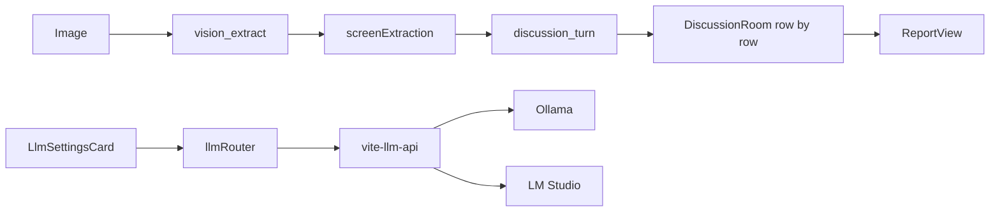

# UX Expert Panel (UXPERTVIEW)

פאנל מומחי UX לבדיקות שימושיות — ממשק בעברית (RTL), עיצוב Podium, ניהול מומחים, שמירת בדיקות ב-localStorage וסנכרון Skills ל-Cursor.

**מאגר:** [github.com/moran4829/ux-expert-panel](https://github.com/moran4829/ux-expert-panel)

## הרצה מקומית

**דרישות:** Node.js, (אופציונלי) [Ollama](https://ollama.com/) או [LM Studio](https://lmstudio.ai/) לניתוח מקומי

1. התקנת תלויות:
   ```bash
   npm install
   ```
2. הרצת האפליקציה (חובה — גם ל-API של LM Studio ו-Skills):
   ```bash
   npm run dev
   ```
   האפליקציה נפתחת בדרך כלל ב-`http://localhost:3000`

3. **אופציונלי — Ollama (מומלץ ל-POC):**
   ```bash
   ollama pull qwen2.5vl:7b   # Vision — חילוץ JSON מהמסך
   ollama pull qwen3:14b      # דיון מומחים + ניתוח מובנה
   ollama pull qwen3:30b      # איגוד דוח (אופציונלי)
   ```
   בהגדרות האפליקציה: **הגדרות → מנועי LLM מקומיים** — הקצו מודל לכל משימה.

4. **אופציונלי — LM Studio:** הפעילו Local Server (`http://localhost:1234/v1`), טענו מודל ראייה/טקסט, והקצו בטבלת המשימות.

5. **בדיקה עם חומר (קישור/תמונה):** נדרש LLM מקומי (לא מצב דמו). מצב **דמו** לא מנתח חומר שהועלה.

> `@google/genai` ב-`package.json` שמור לעתיד (Gemini בענן) — **לא מחובר ל-UI** כרגע.

---

## מנוע LLM מקומי — Hybrid + Task Routing

### זרימה

1. **Vision** (`vision_extract`) — לפני הדיון: מודל ראייה מחלץ JSON אובייקטיבי מהצילום.
2. **דיון שורה-שורה** (`discussion_turn`) — כל מומחה מדבר בתורו עם JSON + Skill + תמליל.
3. **ניתוח מובנה** (`expert_reasoning`) — בעת הפקת דוח: JSON מובנה לכל מומחה.
4. **איגוד דוח** (`report_aggregate`) — מיזוג ממצאים לתוכנית פעולה.

| משימה | מודל POC מומלץ |
|-------|----------------|
| `vision_extract` | `qwen2.5vl:7b` |
| `discussion_turn` | `qwen3:14b` |
| `expert_reasoning` | `qwen3:14b` |
| `report_aggregate` | `qwen3:30b` |

הגדרות נשמרות ב-localStorage (`uxpert_llm_settings`) ב-**הגדרות → מנועי LLM מקומיים**.

### ארכיטקטורה



### קבצים מרכזיים

- [`vite-llm-api.ts`](vite-llm-api.ts) — `POST /api/chat`, `GET /api/llm/models`, `GET /api/llm/health`, `POST /api/llm/pull`
- [`src/lib/llmRouter.ts`](src/lib/llmRouter.ts) — ניתוב מודל לפי משימה
- [`src/lib/reviewEngine/visionExtract.ts`](src/lib/reviewEngine/visionExtract.ts) — חילוץ JSON מהמסך
- [`src/lib/reviewEngine/expertReasoning.ts`](src/lib/reviewEngine/expertReasoning.ts) — ניתוח מומחה מובנה
- [`src/lib/reviewEngine/aggregateReport.ts`](src/lib/reviewEngine/aggregateReport.ts) — איגוד דוח
- [`src/lib/llm.ts`](src/lib/llm.ts) — prompts לדיון + תגים `[OBSERVATION]` / `[CONFLICT]` / `[RECOMMENDATION]`
- [`src/pages/Settings/LlmSettingsCard.tsx`](src/pages/Settings/LlmSettingsCard.tsx) — הקצאת מודל לכל משימה
- [`src/pages/Discussion/DiscussionRoom.tsx`](src/pages/Discussion/DiscussionRoom.tsx) — Vision pre-flight + דיון

### חומרי בדיקה (קישור / תמונה / סרטון)

| מקור | מה קורה |
|------|---------|
| **קישור HTTP(S)** | השרת (`/api/material/analyze-url`) טוען את הדף, אוסף כותרת/תיאור ו-`og:image`, ושולח תמונה למודל הראייה |
| **תמונה** | נדחסת ונשמרת בפרויקט, נשלחת ל-Gemma כ-`image_url` |
| **סרטון** | נלקח פריים מייצג בדפדפן, נשלח כתמונה למודל |

> **מקור האמת לניתוח:** רק החומר שהועלה (תמונה/קישור/פריים מסרטון). שדות תחום/מטרה בוויזארד הם אופציונליים. מצב **דמו** חסום כשיש חומר — לא יוצג תרחיש checkout לדוגמה.

### זרימת דיון

1. בהגדרות: הקצו מודלים לכל משימה (Vision, דיון, ניתוח, איגוד).
2. בוויזארד: העלו צילום מסך → בחרו מומחים → חדר דיון.
3. Vision רץ אוטומטית לפני הדיון (אם הוגדר מודל).
4. כל מומחה מדבר **בתורו** — מודל `discussion_turn`.
5. בהפקת דוח: `expert_reasoning` + `report_aggregate` (אם לא מצב דמו).

### API (פיתוח)

| Endpoint | שיטה | תפקיד |
|----------|------|--------|
| `/api/chat` | POST | צ'אט ל-Ollama או LM Studio (`provider`, `baseUrl`, `model`) |
| `/api/llm/models` | GET | רשימת מודלים מותקנים |
| `/api/llm/health` | GET | בדיקת חיבור לספק |
| `/api/llm/pull` | POST | `ollama pull` למודל מומלץ |

### פתרון: "Empty response from LM Studio"

מודלים עם **מצב חשיבה** (למשל `google/gemma-4-e4b`) עלולים לצרוך את כל ה-tokens ל-`reasoning_content` ולהשאיר את `content` ריק.

**מה האפליקציה עושה:** `max_tokens=1024`, `reasoning_effort=low`, וניסיון חוזר עם יותר tokens אם התשובה ריקה.

**מה לבדוק ב-LM Studio:**

1. Local Server פעיל, המודל **טעון** (לא רק ברשימה).
2. ב-Developer Settings: אם יש אפשרות ל-**Reasoning** — נסו `low` / `off` למודל.
3. הגדילו **Context / Max Tokens** בשרת (לפחות 1024 לפלט).
4. הפעילו מחדש `npm run dev` אחרי עדכון קוד.
5. בחדר דיון: **המשך ניתוח** אחרי שגיאה, או בדיקה חדשה.

### מגבליות

- **Gemini / ענן** — לא מחובר ל-UI (שמור לעתיד).
- **`npm run build`** — אין middleware של Vite; לפרודקשן נדרש שרת proxy נפרד ל-Ollama/LM Studio.
- סנכרון Skills ל-`.cursor/skills/` דורש גם כן `npm run dev` (פלאגין נפרד: [`vite-skills-api.ts`](vite-skills-api.ts)).

---

## תכונות נוספות

- עריכת מומחים, אווטארים ו-Skills בהגדרות
- ארכיון בדיקות וייצוא/ייבוא JSON
- אייקוני Vuesax, עיצוב Podium, Noto Sans Hebrew
