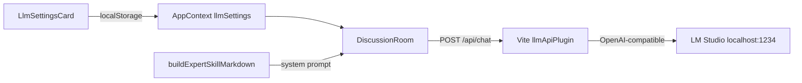

# UX Expert Panel (UXPERTVIEW)

פאנל מומחי UX לבדיקות שימושיות — ממשק בעברית (RTL), עיצוב Podium, ניהול מומחים, שמירת בדיקות ב-localStorage וסנכרון Skills ל-Cursor.

**מאגר:** [github.com/moran4829/ux-expert-panel](https://github.com/moran4829/ux-expert-panel)

## הרצה מקומית

**דרישות:** Node.js, (אופציונלי) [LM Studio](https://lmstudio.ai/) לדיון חי עם מודל מקומי

1. התקנת תלויות:
   ```bash
   npm install
   ```
2. הרצת האפליקציה (חובה — גם ל-API של LM Studio ו-Skills):
   ```bash
   npm run dev
   ```
   האפליקציה נפתחת בדרך כלל ב-`http://localhost:3000`

3. **אופציונלי — LM Studio:** הפעילו Local Server (`http://localhost:1234/v1`), טענו מודל, ובחרו **LM Studio** בהגדרות האפליקציה. ניתן להגדיר ברירות מחדל בשרת דרך `.env` (העתיקו מ-[`.env.example`](.env.example)):
   ```env
   LM_STUDIO_BASE_URL=http://localhost:1234/v1
   LM_STUDIO_MODEL=google/gemma-4-e4b
   ```

4. **בדיקה עם חומר (קישור/תמונה):** נדרש **LM Studio** — ברירת המחדל היא `lm_studio`. מצב **דמו** לא מנתח חומר שהועלה (רק לפרויקטים ללא קישור/קובץ).

> `@google/genai` ב-`package.json` שמור לעתיד (Gemini בענן) — **לא מחובר ל-UI** כרגע.

---

## חיבור LLM מקומי (LM Studio)

### רקע

לפני החיבור, חדר הדיון ([`src/pages/Discussion/DiscussionRoom.tsx`](src/pages/Discussion/DiscussionRoom.tsx)) השתמש רק בהודעות סטטיות מ-[`src/data/defaultDiscussion.ts`](src/data/defaultDiscussion.ts). נוספה אפשרות לבחור בין:

| מצב | תיאור |
|-----|--------|
| **דמו** (`mock`) | הודעות מוכנות, מוצגות בטיימר (התנהגות מקורית) |
| **LM Studio** (`lm_studio`) | כל מומחה שנבחר בבדיקה מייצר תובנה דרך מודל מקומי |

הגדרות נשמרות ב-localStorage (`uxpert_llm_settings`) ונערכות ב-**הגדרות → מנוע דיון (LLM)**.

### ארכיטקטורה



1. הממשק קורא ל-`/api/chat` (רק ב-`npm run dev`).
2. פלאגין Vite ([`vite-llm-api.ts`](vite-llm-api.ts)) מעביר ל-LM Studio בפורמט OpenAI (`/v1/chat/completions`).
3. לכל מומחה: **system prompt** = תוכן ה-Skill ([`buildExpertSkillMarkdown`](src/lib/expertSkill.ts)) + הקשר הבדיקה + תמליל קודם.

### קבצים מרכזיים

- [`vite-llm-api.ts`](vite-llm-api.ts) — Proxy: `POST /api/chat`, `GET /api/llm/health`
- [`src/lib/llm.ts`](src/lib/llm.ts) — בניית prompt, קריאת API, פרסור תגים `[OBSERVATION]` / `[CONFLICT]` / `[RECOMMENDATION]`
- [`src/lib/llmDefaults.ts`](src/lib/llmDefaults.ts) — ברירות מחדל: `lm_studio`, URL, מודל `google/gemma-4-e4b`
- [`src/types/llm.ts`](src/types/llm.ts) — `LlmProvider`, `LlmSettings`
- [`src/pages/Settings/LlmSettingsCard.tsx`](src/pages/Settings/LlmSettingsCard.tsx) — בחירת ספק + בדיקת חיבור
- [`src/pages/Discussion/DiscussionRoom.tsx`](src/pages/Discussion/DiscussionRoom.tsx) — לולאת דיון (דמו / LM Studio)
- [`src/AppContext.tsx`](src/AppContext.tsx) + [`src/lib/storage.ts`](src/lib/storage.ts) — state ושמירה

### חומרי בדיקה (קישור / תמונה / סרטון)

| מקור | מה קורה |
|------|---------|
| **קישור HTTP(S)** | השרת (`/api/material/analyze-url`) טוען את הדף, אוסף כותרת/תיאור ו-`og:image`, ושולח תמונה למודל הראייה |
| **תמונה** | נדחסת ונשמרת בפרויקט, נשלחת ל-Gemma כ-`image_url` |
| **סרטון** | נלקח פריים מייצג בדפדפן, נשלח כתמונה למודל |

> **מקור האמת לניתוח:** רק החומר שהועלה (תמונה/קישור/פריים מסרטון). שדות תחום/מטרה בוויזארד הם אופציונליים. מצב **דמו** חסום כשיש חומר — לא יוצג תרחיש checkout לדוגמה.

### זרימת דיון ב-LM Studio

1. בהגדרות: בוחרים **LM Studio** (אפשר **בדיקת חיבור**).
2. בוויזארד בדיקה חדשה: בוחרים מומחים → נכנסים לחדר דיון.
3. כל `selectedExperts` מדבר **בתורו** — קריאה אחת ל-API למומחה.
4. המודל מחזיר טקסט בעברית; שורה ראשונה עם תג סוג ההודעה.
5. ההודעות נשמרות ב-`project.messages` (localStorage דרך `AppContext`).

### API (פיתוח)

| Endpoint | שיטה | תפקיד |
|----------|------|--------|
| `/api/chat` | POST | שליחת `messages` ל-LM Studio (`baseUrl`, `model` מהגדרות UI) |
| `/api/llm/health` | GET | בדיקה ש-`http://localhost:1234/v1/models` זמין |

### פתרון: "Empty response from LM Studio"

מודלים עם **מצב חשיבה** (למשל `google/gemma-4-e4b`) עלולים לצרוך את כל ה-tokens ל-`reasoning_content` ולהשאיר את `content` ריק.

**מה האפליקציה עושה:** `max_tokens=1024`, `reasoning_effort=low`, וניסיון חוזר עם יותר tokens אם התשובה ריקה.

**מה לבדוק ב-LM Studio:**

1. Local Server פעיל, המודל **טעון** (לא רק ברשימה).
2. ב-Developer Settings: אם יש אפשרות ל-**Reasoning** — נסו `low` / `off` למודל.
3. הגדילו **Context / Max Tokens** בשרת (לפחות 1024 לפלט).
4. הפעילו מחדש `npm run dev` אחרי עדכון קוד.
5. בחדר דיון: **המשך ניתוח** אחרי שגיאה, או בדיקה חדשה.

### מגבליות

- **דוח סופי** (`findings`, `scores`) עדיין מ-[`src/data/defaultFindings.ts`](src/data/defaultFindings.ts) — לא נוצר אוטומטית מה-LLM.
- **Gemini / ענן** — לא מחובר ל-UI (שמור לעתיד).
- **`npm run build`** — אין middleware של Vite; לפרודקשן נדרש שרת proxy נפרד ל-LM Studio (אם רוצים LLM גם שם).
- סנכרון Skills ל-`.cursor/skills/` דורש גם כן `npm run dev` (פלאגין נפרד: [`vite-skills-api.ts`](vite-skills-api.ts)).

---

## תכונות נוספות

- עריכת מומחים, אווטארים ו-Skills בהגדרות
- ארכיון בדיקות וייצוא/ייבוא JSON
- אייקוני Vuesax, עיצוב Podium, Noto Sans Hebrew
